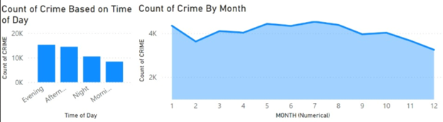
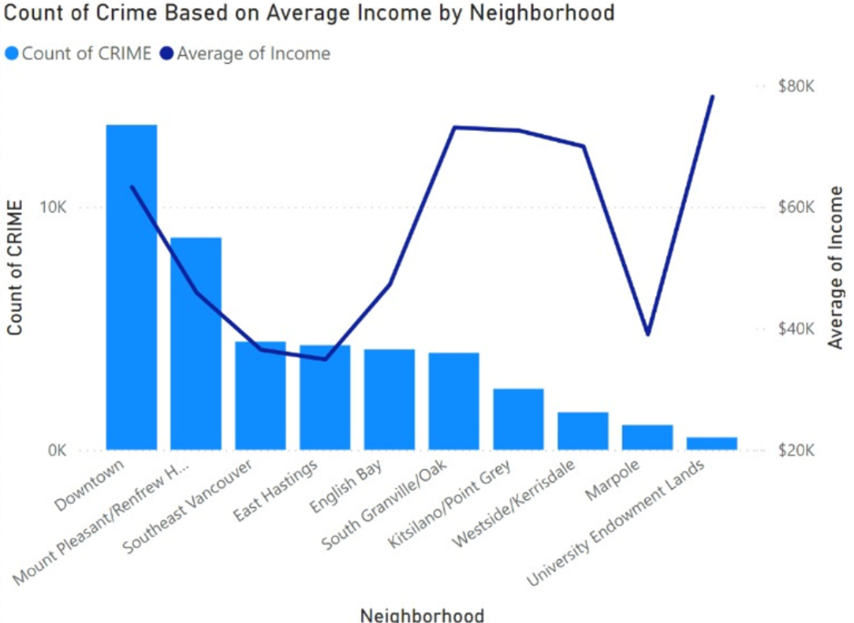

# VPD-Data-Analysis
## Overview
In this project, I looked at VPD data, Housing Market Data, and Census Data to compare crime rates among different neighbourhoods in Vancouver to see the overview of which neighbourhood seems to have the most crime and what type of crime is being committed the most in that area.
## Problem Statement 
How can the Vancouver Police Department (VPD) reduce crime rates by identifying socioeconomic factors involving income levels, education and employment.
## Analytical Questions
- AQ 1) What is the relationship between household income levels and types of crimes in specific neighborhoods? 
- AQ 2) Is there a correlation between unemployment rates and specific types of crime in various neighborhoods? 
- AQ 3) How does educational attainment in households correlate with crime rates across neighborhoods? 
- AQ 4) Are there seasonal or monthly trends in crime rates associated with occurrence of crime (e.g., during holiday seasons)? 
- AQ 5) What form of relationship exists between housing availability and crime rates? 
## Findings
### Figure 1

The Tree map visualization utilized here shows the quantity of crime in each neighbourhood, showing clearly that the “Downtown” sector holds the greatest number of crimes in the VPD area.
## Figure 2

The pie chart shows the crime rate’s relationship to months of year, to help discover if there is a significant relationship between crime rates and seasonality. Findings show a slight majority towards the “Summer” season; however, it is a very even distribution.
## Figure 3

The bar graph shows the count of crime of each type reported within the data, seeing a majority in theft, whilst break and enters, mischief and offenses against individuals filling the rest of the distribution evenly.
## Figure 4

The line/bar combo charts show the correlation between the month of the year and the quantity of crimes, as well as the time of day the crime was committed. This is filtered and changed based on the neighborhood selected.
## Figure 5

The tree map visualization used here shows the type of crime distribution that will be utilized to filter the remaining data on the dashboard. It outlines that the “Theft” segment holds most crimes committed.
## Figure 6

The bar/line chart combo showcases the relationship between the quantity of crime committed and the average total income level among recipients, it is evident that higher income in wealthier neighborhoods accounts for less crime.
## Figure 7

The combo chart shows the correlation between the crime rates in each selected neighbor and the average rent in those areas. The graph shows a fair correlation between the two factors in areas like “Downtown” and “Mount Pleasant” who have higher average rents and high crime rates, and less correlated with areas like “University Endowment Land” with high average rents and little crime.
## Figure 8

The combo chart illustrates the relationship between the number of crimes and the unemployment levels in each neighborhood. Neighborhoods such as "Downtown," "Southeast Vancouver," and "East Hastings" exhibit both high unemployment rates and high crime counts. In contrast, wealthier neighborhoods like Marpole experience lower unemployment rates and fewer crimes. Notably, findings indicate that while the overall quantity of crime is correlated with unemployment levels, the distribution of crime types remains consistent across neighborhoods, regardless of economic conditions.
## Figure 9

The combo chart shows the crime rate through each neighbourhood and how that correlates to the education level of the residents within each area. It is clear that these two variables are closely related as shown in the “Mount Pleasant/Renfrew Heights” sector that show high crime rates and large levels of lower education, and the opposite in areas like Kitsilano/Point Grey who see declining crime rates and more educated residents.
## Figure 10

The combo chart shown here shows the uncorrelation between vacancy rate and crime rates based on each neighbourhood. There is a clear major spike in vacancy rates in wealthier neighbourhoods like “Westside/Kerrisdale”, “Marpole” and “University Endowment Lands” however very little crime rates, which shows that the assumed theft that would occur in these vacant homes is not occurring.
